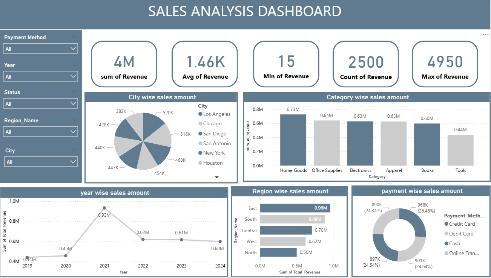

# 📊 Sales Analysis Dashboard (Power BI)

## 🔍 Overview

This project presents a **Sales Analysis Dashboard** built in Power BI to track and analyze revenue performance across multiple dimensions such as category, region, year, city, and payment method.

The dashboard helps in identifying key business trends and supports data-driven decision making.

---

## 📌 Key Features

* 💰 Total Revenue Overview (4M+)
* 📊 Category-wise Sales Analysis
* 🌍 Region-wise Revenue Breakdown
* 🏙️ City-wise Sales Distribution
* 📅 Year-wise Sales Trend
* 💳 Payment Method Analysis
* 🎯 Interactive Filters (Year, Region, City, Status, Payment Method)

---

## 🖼️ Dashboard Preview

---

## 🛠️ Tools & Technologies

* Power BI
* Microsoft Excel / CSV
* Data Visualization Techniques

---

## 📊 Key Insights

* 🏆 **Home Goods** category generated the highest revenue
* 📈 Peak sales observed in **2021**
* 🌍 **East region** contributes the highest sales
* 💳 **Credit Card transactions** dominate payment methods
* 📉 Sales show slight decline after peak year

---

## 📂 Project Structure

* `Sales_Analysis_Dashboard.pbix` → Power BI file
* `Sales_Analysis_Dashboard.png` → Dashboard preview
* `Sales_Analysis_Database.xlsx` → Source dataset

---

## 🚀 How to Use

1. Download the `.pbix` file
2. Open using Power BI Desktop
3. Explore interactive visuals using filters

---

## 🎯 Purpose of the Project

This project demonstrates:

* Data cleaning and transformation
* Data modeling
* Dashboard design
* Business insight generation

---

## 📌 Conclusion

The dashboard provides a comprehensive view of sales performance and helps stakeholders quickly understand trends, patterns, and opportunities for growth.

---

